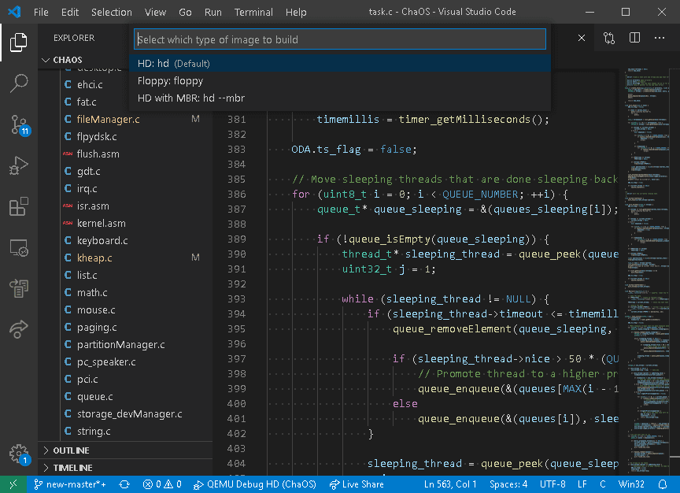
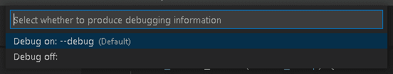
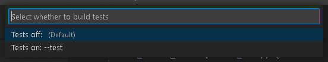
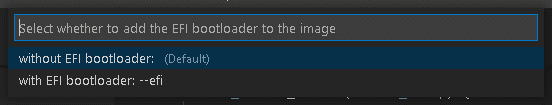
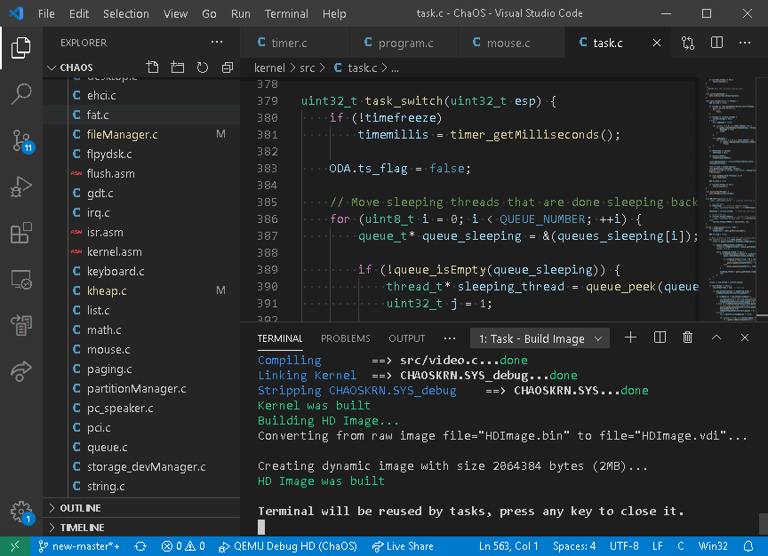
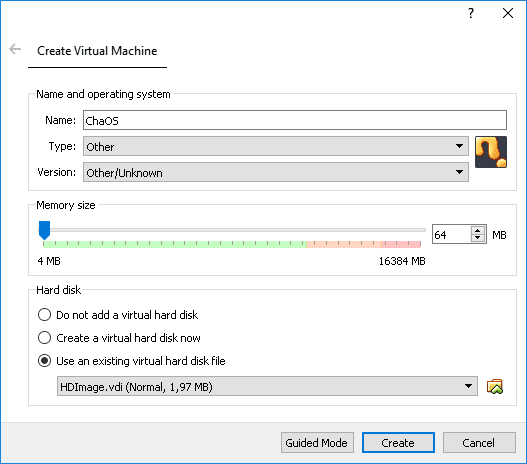
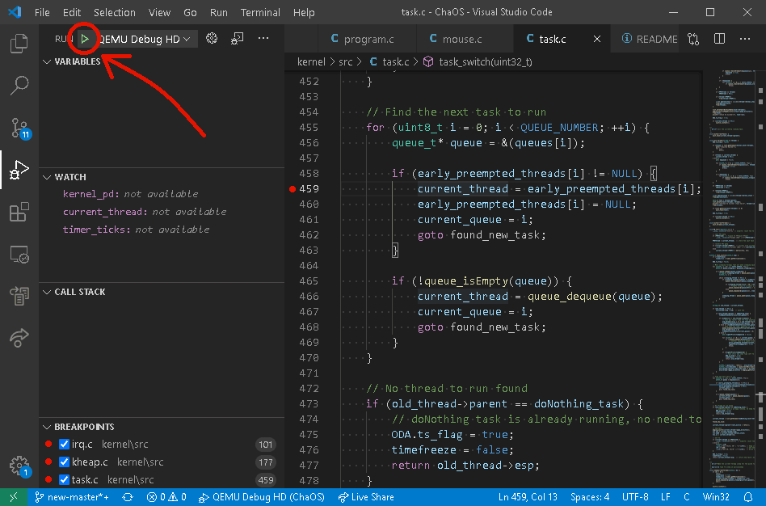
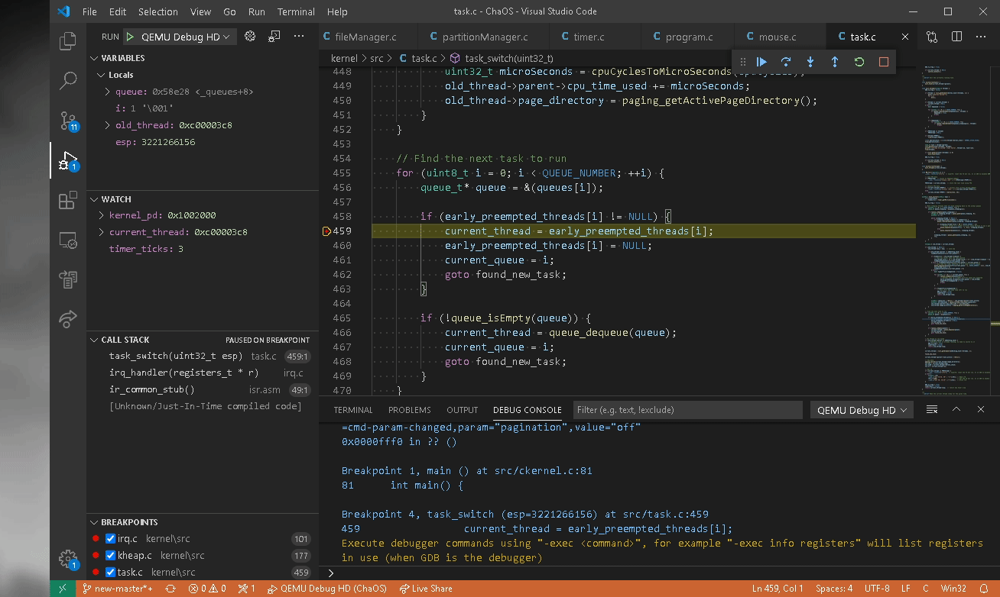
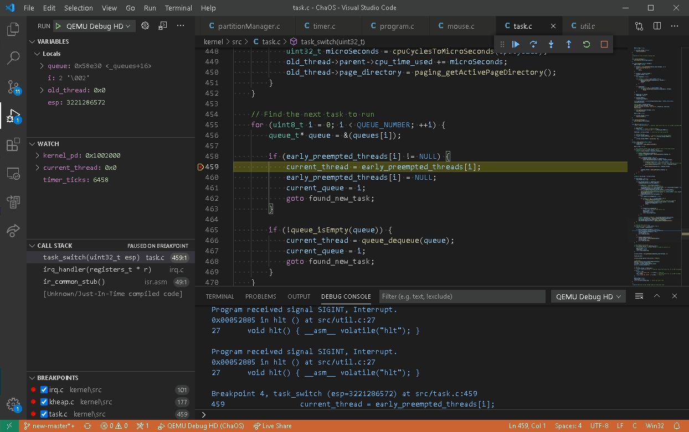

ChaOS
=====

[](https://github.com/Filiprogrammer/ChaOS/actions/workflows/main.yml)

What is ChaOS?
--------------

ChaOS is a hobbyist x86 operating system written from scratch in C.

Features
--------

- Legacy BIOS bootloader
- EFI bootloader
- Pre-emptive single CPU MLFQ multitasking
- PS/2 keyboard & mouse support
- VGA text & graphics
- ATA hard drive support
- Floppy support
- FAT file system support
- ELF user programs

Building
--------

*Note: It is recommended to have at least 1 GB of free storage*

### Clone the ChaOS repository

*Note: Do not clone the repository into a path containing whitespaces*

```console
git clone https://github.com/Filiprogrammer/ChaOS.git

cd ChaOS
```

### Download tools

#### Debian

Install wget and unzip if not already installed

```console
sudo apt install wget unzip
```

Download ChaOS tools

```console
./download_tools.sh
```

#### Arch Linux

Install wget and unzip if not already installed

```console
sudo pacman -Sy wget unzip
```

Download ChaOS tools

```console
./download_tools.sh
```

#### Fedora

Install wget and unzip if not already installed

```console
sudo yum install wget unzip
```

Download ChaOS tools

```console
./download_tools.sh
```

#### Windows

Download ChaOS tools

```console
DOWNLOAD_TOOLS.BAT
```

### Build image

#### Linux

```console
./build_image.sh hd
```

#### Windows

```console
BUILD_IMAGE.BAT hd
```

#### VSCode

Press <kbd>Ctrl</kbd> + <kbd>Shift</kbd> + <kbd>B</kbd>

A select dialog will appear where the configuration to be built can be selected.









Once a configuration has been selected, the build process will start and progress can be tracked in the bottom terminal window. The build script might also ask which user programs to build.



Running
-------

### QEMU

To run ChaOS in QEMU, just use the following script.

#### Windows

```console
QEMU_BOOT.BAT hd
```

#### Linux

```console
./qemu_boot.sh hd
```

### VirtualBox

To run ChaOS in VirtualBox, create a new virtual machine with at least 32 MB of memory and use the generated HDImage.vdi file as a virtual hard disk.



Debugging
---------

### Debugging in VSCode

To start debugging in VSCode, press <kbd>Ctrl</kbd> + <kbd>Shift</kbd> + <kbd>D</kbd> or click on the Run tab on the left. Then select a debug configuration and click the green arrow to start debugging.



During debugging, while the OS is paused, GUI tools can be launched to see, for example, which tasks are running and in which queue they are.
To use that, simply type `-exec source ../../gdb_tasks_gui.py` into the Debug Console.



Another graphical debugging tool would be a tool that can be used to inspect the heap of the kernel. This can be launched by typing `-exec source ../../gdb_heap_gui.py` into the Debug Console.


